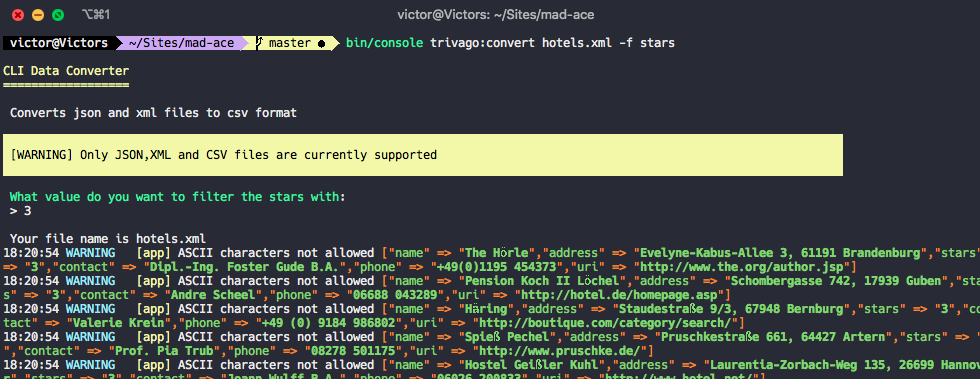
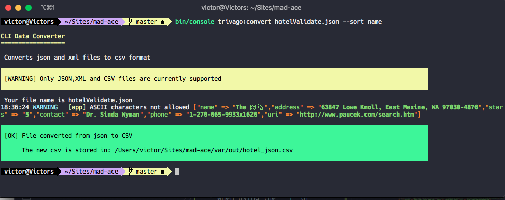

# Setup
*  Run "composer install"
*  Ensure all files to be converted are in the `var/in` directory
*  To start converting files e.g convert from json to csv, Enter this command in the console   **`bin/console trivago:convert hotels.json`**
  
# PHPUnit Testing
* To run test and code coverage **`./vendor/bin/simple-phpunit --coverage-html reports/`**

# Commands
### Required Inputs
* Default command: **`bin/console trivago:convert {filename}`**
### Optional Inputs
- Filtering data:   **`-f {argument}`** OR **`--filter {argument}`**
   
    - Usage:   **`bin/console trivago:convert hotels.json -f stars`** (Then enter the required value)

- Sorting data:   **`-s {argument}`** OR **`--sort {argument}`**
  
    - Usage:   **`bin/console trivago:convert hotels.json -s name`**
* Grouping data:   **`-g {argument}`** OR **`--group {argument}`**
    - Usage:   **`bin/console trivago:convert hotels.json -s name`**
# Using Commands
- To filter and sort the hotels data: - 
 
**`bin/console trivago:convert hotels.json --sort name -f stars`** 
 OR
  
**`bin/console trivago:convert hotels.json -s name -f stars`**
 
- Using filter and group -
 
**`bin/console trivago:convert hotels.json -f stars -g stars`** 
 OR
  
**`bin/console trivago:convert hotels.json --filter stars --group stars`**
  
- Using group and sorting hotel data:-
  
**`bin/console trivago:convert hotels.xml -g stars --sort name`** 
OR **`bin/console trivago:convert hotels.xml --group stars -s name`**

# Guide
 * When using the **`-f`** or **`--filter`** optional input argument, it's required that a value is added.
 

 * Using **`-s`** or **`--sort`** 
  